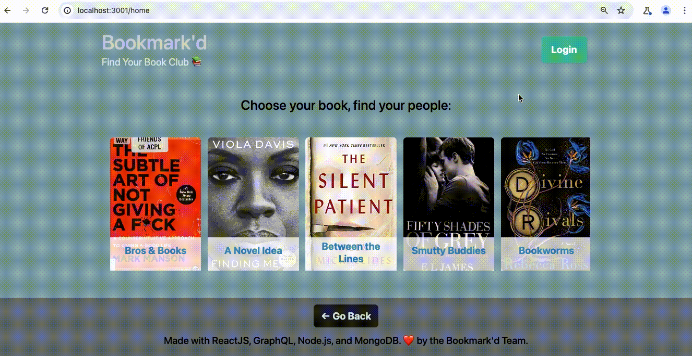

# Bookmark'd

📚 Bookmark'd is a digital space for like-minded readers to connect and create a book club, based on their choice of "book of the month" read. Login, go to your book club page, and comment as you go! A more modern way to connect as you read 📚

## Chapters

1. [Team](#team)
2. [Bookmark'd App](#bookmarkd-app)
   - [The Book Clubs](#the-book-clubs)
   - [Pages](#pages)
   - [Challenges](#challenges)
3. [Project Requirements](#project-requirements)
4. [Future Developments](#future-developments)

## Team

[Jessica Scheck](https://github.com/Jessmica11)

[Jose Silva](https://github.com/Chepit00)

[Chanel Scrivens](https://github.com/Cscrivens)

[Kassandra Quintana](https://github.com/kassandraq)

[Kurstie DeHaven](https://github.com/kurstiedehaven)

## Bookmark'd App

```
AS A user
I WANT TO be able to find a book club based on the book of the month that I choose
I WANT TO have the ability to login with my own credentials
I WANT TO have a profile where I can view my profile information and current book clubs
SO THAT I CAN go to the book club page and add comments as I read, and read comments by the other club members
```

### The Book Clubs

```
BOOK CLUBS      -       BOOK GENRE(S)
-----------------------------------
Bros & Books 💪  - Inspirational/Self-Development
A Novel Idea 👓 - Non-Fiction
Between the Lines 🔪 -Thriller/Horror/Mystery
Smutty Buddies 🔥 - Romance/Fantasy
Bookworms 🐛  - Historical Fiction/Classic Literature
```

### Pages

"/home" - Homepage, which will show the 5 "books of the month"


"/auth" - Where the user can login with their credentials


"/profile/[ username ]" - Each user will have a profile page that displays their bio and shows their current book club(s)

"/bookclub/[ bookclubId ]" - Each book club will have a page where you can see a list of comments

### Challenges

We will keep track of our challenges here

## Project Requirements

Your group will use everything you’ve learned throughout this course to create a MERN stack single-page application that works with real-world data to solve a real-world challenge, with a focus on data and user demand. This project will provide you with the best opportunity to demonstrate your problem-solving skills, which employers will want to see during interviews. Once again, the user story and acceptance criteria will depend on the project that you create, but your project must fulfill the following requirements:

- Use React for the front end.

- Use GraphQL with a Node.js and Express.js server.

- Use MongoDB and the Mongoose ODM for the database.

- Use queries and mutations for retrieving, adding, updating, and deleting data.

- Be deployed using Heroku (with data).

- Have a polished UI.

- Be responsive.

- Be interactive (i.e., accept and respond to user input).

- Include authentication (JWT).

- Protect sensitive API key information on the server.

- Have a clean repository that meets quality coding standards (file structure, naming conventions, best practices for class and id naming conventions, indentation, high-quality comments, etc.).

- Have a high-quality README (with unique name, description, technologies used, screenshot, and link to deployed application).

### CSS Styling

Instead of using a CSS library like Bootstrap, consider one of the following suggestions:

- Look into the concept of CSS-in-JS, which abstracts CSS to the component level, using JavaScript to describe styles in a declarative and maintainable way. Some popular libraries include [styled-components](https://styled-components.com/) and [Emotion](https://emotion.sh/docs/introduction).

- Try using a component library, such as [Semantic UI](https://semantic-ui.com/), [Chakra UI](https://chakra-ui.com/), or [Ant Design](https://ant.design/).

- Create all the CSS for your application just using CSS.

Ultimately, it doesn't matter which of these options you choose&mdash;it just needs to look professional and be mobile-friendly.

### Payment Platform

Consider integrating the Stripe payment platform. Even if you don’t create an e-commerce application, you could set up your site to accept charitable donations.

### Bonus

Although this is not a requirement for your project, see if you can also implement functionality to meet the minimum requirements of a PWA:

- Uses a web manifest

- Uses a service worker for offline functionality

- Is installable

## Presentation Requirements

Use this [project presentation template](https://docs.google.com/presentation/d/10QaO9KH8HtUXj__81ve0SZcpO5DbMbqqQr4iPpbwKks/edit?usp=sharing) to address the following:

- Elevator pitch: a one minute description of your application

- Concept: What is your user story? What was your motivation for development?

- Process: What were the technologies used? How were tasks and roles broken down and assigned? What challenges did you encounter? What were your successes?

- Demo: Show your stuff!

- Directions for Future Development

- Links to the deployed application and the GitHub repository. Use the [Guide to Deploy with Heroku and MongoDB Atlas](https://coding-boot-camp.github.io/full-stack/mongodb/deploy-with-heroku-and-mongodb-atlas) on The Full-Stack Blog if you need a reminder on how to deploy to Heroku.

## Future Developments

We will add ideas for functionality/design that we would add if we had more time/more knowledge.

---

© 2023 edX Boot Camps LLC. Confidential and Proprietary. All Rights Reserved.
